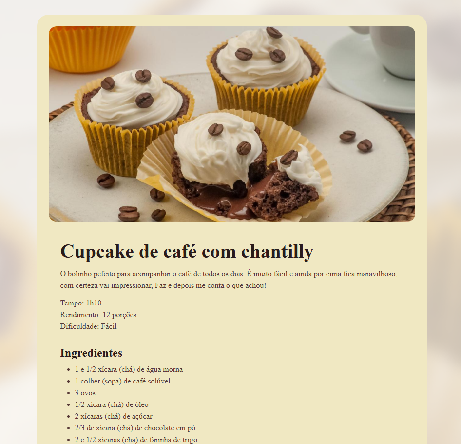

# Página de Receita de Cupcake

Este projeto é uma página web simples em HTML e CSS que apresenta uma receita de cupcake de café com chantilly. O design é responsivo e usa fontes externas para deixar a apresentação mais elegante.

## Estrutura do Projeto

- `index.html` — página principal com título, descrição, ingredientes e modo de preparo.
- `style.css` — estilos visuais para layout, tipografia, responsividade e elementos da página.
- `assets/` — contém imagens utilizadas no site (fundo e imagem principal).

## Funcionalidades

- Layout limpo e centralizado para leitura confortável.
- Imagem de destaque com bordas arredondadas.
- Informações de tempo, rendimento e dificuldade.
- Lista de ingredientes e modo de preparo detalhado.
- Estilo responsivo para telas menores.

## Como usar

1. Abra o arquivo `index.html` em um navegador.
2. A página será exibida automaticamente com o estilo definido em `style.css`.

## Autor

Feito por Victor Koithi.
